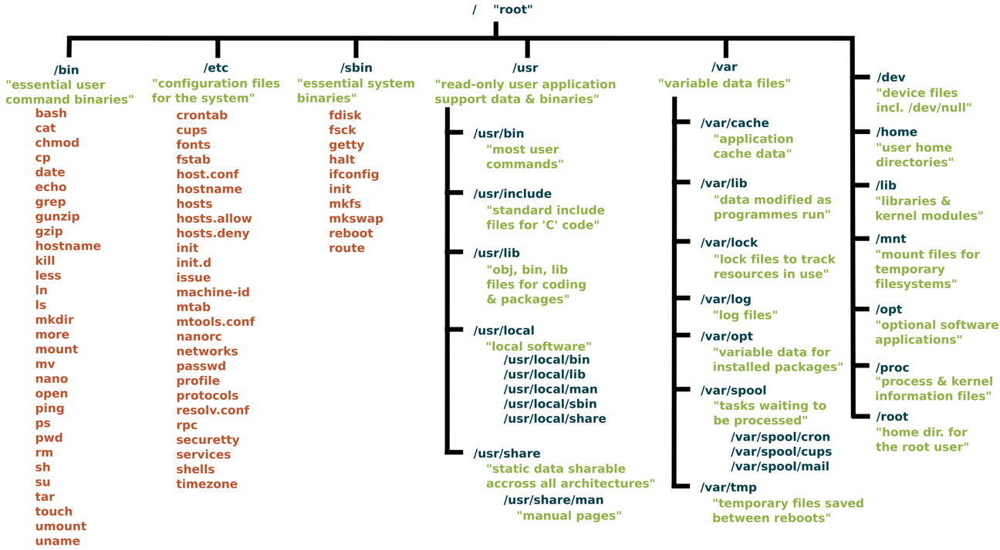

### Memento Linux

#### [Retour](../index.md)

### Répertoires racine d'une distribution linux


#### Bash rapide
##### Extension bash : ``.sh``
##### Ajouter les droits d'execution : ``chmod +x script.sh``
##### Execution du script ``./script.sh``
##### Afficher des informations (Menu / resultat etc...)

```bash
echo HelloWorld
```

##### Variable + affichage
```bash
# String
var="ma variable"
# Int 
number=123

echo $var
echo $number
```

##### Si Sinon
```bash
if [condition];then
	...
elif [condition];then
	...
else
	...
fi
```

##### Opérateurs
```bash
# OPERATEUR DE TEXTE
	== : égal
	!= : différent de
	! négation en général
# OPERATEUR FILE SYSTEME
	-z : variable vide
	<= : inf ou égal
	>= : sup ou égal
```

##### Arguments
```bash
$1 : Premier argument
$2 : Second argument
$# : Nombre d'arguments
$* : Tous les arguments en variables
$@ : Tous les arguments en tableau
$0 : Nom du script
```
##### Concaténation
```bash
sport=foot

echo "the most popular sport is ${sport}ball"
```
Résultat de la concaténation : 
``the most popular sport is football``

##### Entrée utilisateur + Affichage de l'entrée utilisateurs
```bash
# Simple entrée utilisateur
read -p "Enter something : " var
echo $var

# Plusieurs variables

echo "Enter full name : "
read firstname lastname

echo "Your first name is ${firstname}"
echo "Your second name is ${lastname}"
```
##### Boucle 
```bash
for NAMES in $(cat names.txt); do
	echo $NAMES
done
```

##### Function
```bash
function afficher() {
	echo "Fonction Afficher"
}
# Appel de la fonction
afficher
```
