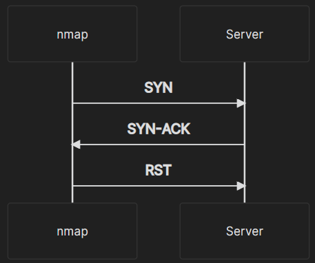
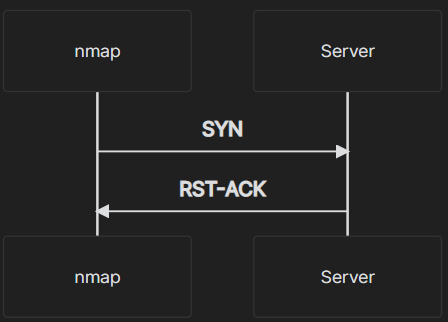

### Comprendre le réseau avec Wireshark
#### [Retour](../index.md)

## TCP - 3 Way Handshake Overview

#### 1 : Le client envoie un pacquet de synchronisation [SYN]
#### 2 : (Si le serveur répond) Il répond par un accusé de réception de synchronisation [SYN-ACK] pour faire savoir au client qu'il est ouvert et prêt à communiquer.
#### 3 : Le client répond par un accusé de réception [ACK]. La session commence alors et le socket est créé.

### Wireshark POV :

___

## NMAP : Scan de port

### **Port ouvert**

#### Wireshark :

### **Port fermer**

#### Wireshark :

