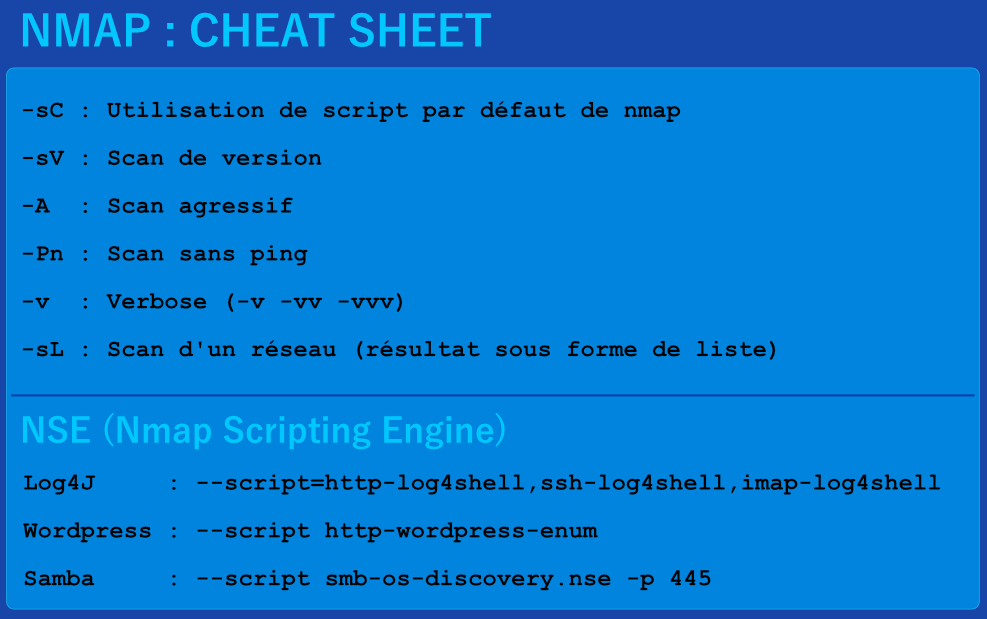

### Outils CTF
#### [Retour](../index.md)

### **Mapping de réseau**

#### Ping Sweep (Linux)
```bash
for i in {1..254} ;do (ping -c 1 192.168.1.$i | grep "bytes from" &) ;done
```

#### Ping Sweep (Windows)
```batch
for /L %i in (1,1,255) do @ping -n 1 -w 200 172.21.10.%i > nul && echo 192.168.1.%i is up.
```

#### Nmap : Outil de reconnaissance actif (ports et services)
[Site officiel de nmap](https://nmap.org/)
```bash
nmap addr_reseau/cidr
```



### **Outil d'énumération d'application Web**

#### ffuf : outil de fuzzing
[Source github](https://github.com/ffuf/ffuf)
##### Utilisation basique: 

| **Commandes**   | **Descriptions**   |
| --------------|-------------------|
| `ffuf -h` | ffuf manuel |
| `ffuf -w wordlist.txt:FUZZ -u http://SERVER_IP:PORT/FUZZ` | Fuzzing de répertoires |
| `ffuf -w wordlist.txt:FUZZ -u http://SERVER_IP:PORT/indexFUZZ` | Fuzzing d'extension |
| `ffuf -w wordlist.txt:FUZZ -u http://SERVER_IP:PORT/blog/FUZZ.php` | Fuzzing de page |
| `ffuf -w wordlist.txt:FUZZ -u http://SERVER_IP:PORT/FUZZ -recursion -recursion-depth 1 -e .php -v` | Fuzzing récursif |
| `ffuf -w wordlist.txt:FUZZ -u https://FUZZ.hackthebox.eu/` | Fuzzing de sous-domaine |
| `ffuf -w wordlist.txt:FUZZ -u http://academy.htb:PORT/ -H 'Host: FUZZ.academy.htb' -fs xxx` | Fuzzing de virtual host |
| `ffuf -w wordlist.txt:FUZZ -u http://admin.academy.htb:PORT/admin/admin.php?FUZZ=key -fs xxx` | Fuzzing avec paramètre (GET) |
| `ffuf -w wordlist.txt:FUZZ -u http://admin.academy.htb:PORT/admin/admin.php -X POST -d 'FUZZ=key' -H 'Content-Type: application/x-www-form-urlencoded' -fs xxx` | Fuzzing avec paramètre (POST) |
| `ffuf -w ids.txt:FUZZ -u http://admin.academy.htb:PORT/admin/admin.php -X POST -d 'id=FUZZ' -H 'Content-Type: application/x-www-form-urlencoded' -fs xxx` | Fuzzing avec des valeurs |  

##### Wordlists basique pour le fuzzing : [SecLists](https://github.com/danielmiessler/SecLists)

| **Chemin par défault (Kali, ParrotOS)**   | **Descriptions**   |
| --------------|-------------------|
| `/opt/useful/SecLists/Discovery/Web-Content/directory-list-2.3-small.txt` | Dossier + Page  |
| `/opt/useful/SecLists/Discovery/Web-Content/web-extensions.txt` | Extensions |
| `/opt/useful/SecLists/Discovery/DNS/subdomains-top1million-5000.txt` | Nom de domaine |
| `/opt/useful/SecLists/Discovery/Web-Content/burp-parameter-names.txt` | Paramètres |
